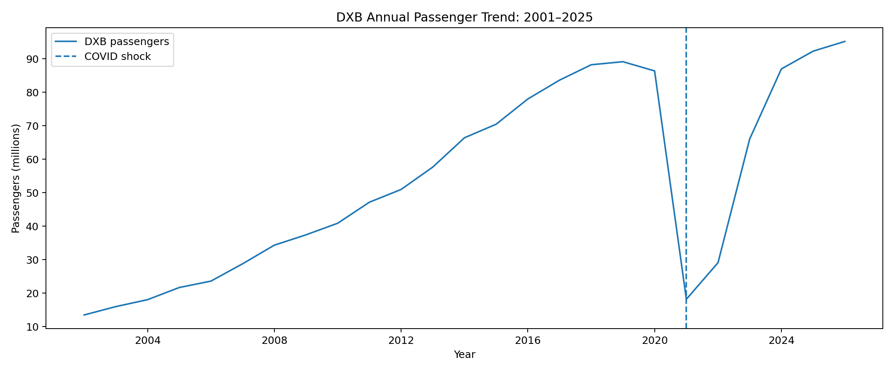
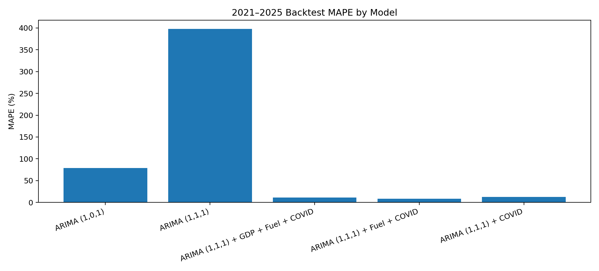
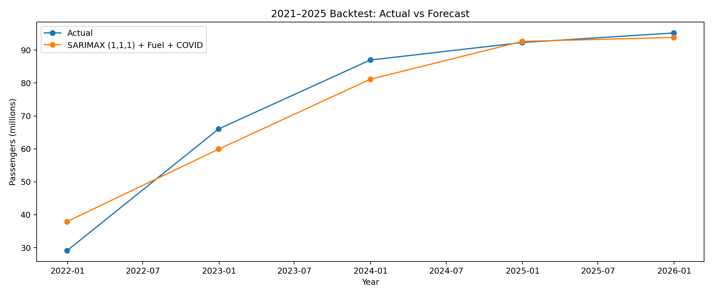
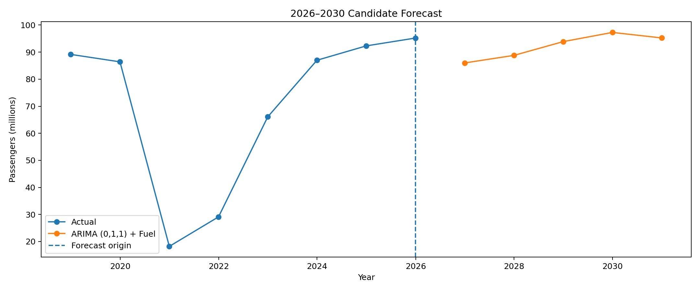

# DXB Long-Term Passenger Forecasting

## ARIMA, SARIMAX, Exogenous Drivers & COVID Structural-Break Analysis

A practical time-series forecasting project focused on estimating
**annual Dubai International Airport (DXB) passenger traffic for
2026--2030**.

The project starts with data exploration and cleaning, then
progressively tests statistical forecasting approaches:

**Data loading → EDA → Cleaning → Time-series preparation → Stationarity
→ ACF/PACF → ARIMA → SARIMAX → Exogenous variables → Backtesting →
Residual diagnostics → Long-term forecast → Structural-break assessment
→ Forecast strategy**

> **Important:** This is a prototype/practice project using a
> synthetic/illustrative DXB-style dataset. It is not an official Dubai
> Airports forecast and the external variables are illustrative
> assumptions.

------------------------------------------------------------------------

## Project Objective

The objective is to build a defensible forecasting workflow for:

> **DXB annual passenger traffic for 2026--2030**

The dataset contains:

-   Annual passenger traffic (`pax`)
-   GDP growth (`gdp_growth_pct`)
-   Average fuel price (`avg_fuel_price_usd_l`)
-   COVID shock/intervention effect (`covid_effect`)

The exercise intentionally includes messy data, missing values,
duplicate records, mixed date formats, and an exceptional COVID
disruption.

------------------------------------------------------------------------

## Dataset

### Period

**2001--2025**

### Target

`pax` --- annual passenger traffic.

### Exogenous variables

  -----------------------------------------------------------------------
  Variable                            Description
  ----------------------------------- -----------------------------------
  `gdp_growth_pct`                    Illustrative annual GDP growth

  `avg_fuel_price_usd_l`              Illustrative average fuel price

  `covid_effect`                      Intervention/shock variable
                                      representing COVID disruption
  -----------------------------------------------------------------------

The raw workbook contains a deliberately messy version of the data.

------------------------------------------------------------------------

## 1. Data Loading & Initial Exploration

The project begins with basic data profiling:

``` python
df.shape
df.info()
df.head()
df.tail()
df.describe()
df.isnull().sum()
df[df.duplicated()]
```

The initial dataset contained:

-   **26 rows**
-   **5 columns**
-   One duplicate record
-   Missing GDP value
-   Missing fuel-price value
-   Mixed date formats

### Initial profiling checklist

``` text
Shape
↓
Data types
↓
Missing values
↓
Duplicates
↓
Descriptive statistics
↓
Date range
↓
Time-series visualization
```

------------------------------------------------------------------------

## 2. Data Cleaning

### Duplicate records

Duplicates were identified and removed:

``` python
df.drop_duplicates(inplace=True)
```

### Missing values

Missing GDP and fuel values were filled using the column mean for this
prototype:

``` python
avg_fuel = df["avg_fuel_price_usd_l"].mean()
avg_gdp = df["gdp_growth_pct"].mean()

df["avg_fuel_price_usd_l"] = df["avg_fuel_price_usd_l"].fillna(avg_fuel)
df["gdp_growth_pct"] = df["gdp_growth_pct"].fillna(avg_gdp)
```

### Date cleaning

The dataset deliberately contained inconsistent date strings such as:

-   `31/05/2005`
-   `2010/12/31`
-   `31-Dec-2016`

These were corrected and converted to datetime.

``` python
df["date"] = pd.to_datetime(df["date"])
df = df.set_index("date")
df = df.sort_index()
```

The cleaned dataset uses a proper `DatetimeIndex`.

------------------------------------------------------------------------

## 3. Exploratory Data Analysis

The passenger series shows three distinct phases:

1.  **Long-term growth before COVID**
2.  **Severe COVID disruption**
3.  **Rapid recovery from 2021 onward**



### Key observation

The COVID period is not simply another fluctuation in the historical
series.

It represents a **structural disruption**:

``` text
2001–2019  → long-term growth regime
2020       → exceptional collapse
2021–2025  → recovery regime
```

This became the central modeling issue in the project.

------------------------------------------------------------------------

## 4. Train/Test Strategy

The first validation setup was:

``` text
Training: 2001–2020
Testing:  2021–2025
```

This creates a five-year out-of-sample test period.

``` python
df_train = df.loc[:"2020", "pax"]
df_test = df.loc["2021":, "pax"]
```

This allows the models to be evaluated on the COVID recovery period.

------------------------------------------------------------------------

## 5. Stationarity Analysis

An Augmented Dickey-Fuller test was used to investigate stationarity.

The project tested differencing and found that first differencing was
useful for the modeling setup.

The working ARIMA configuration therefore used:

``` text
d = 1
```

The project also explored ACF/PACF plots to understand the dependence
structure and select candidate AR/MA terms.

------------------------------------------------------------------------

## 6. ARIMA Baseline

ARIMA was introduced as the baseline model.

Candidate configurations included:

-   ARIMA(1,0,1)
-   ARIMA(1,1,1)

The core modeling workflow was:

``` text
Define model
    ↓
Fit
    ↓
Forecast
    ↓
Evaluate
```

Example:

``` python
model = ARIMA(
    df_train,
    order=(1, 1, 1)
)

model_fit = model.fit()

forecast = model_fit.forecast(len(df_test))
```

### ARIMA(1,1,1) backtest

  Metric      Result
  -------- ---------
  MAE        307.86M
  MAPE       397.88%
  RMSE       338.75M

The model performed poorly when the COVID recovery period was treated as
an ordinary continuation of the historical process.

### Finding

**Simple ARIMA was not sufficient for this recovery regime.**

------------------------------------------------------------------------

## 7. SARIMAX & Exogenous Variables

The next step was to introduce external drivers.

The model used:

``` python
SARIMAX(
    y_train,
    exog=x_train,
    order=(1, 1, 1)
)
```

Although the implementation uses `SARIMAX`, there is no seasonal
component in this annual dataset. Therefore this should be interpreted
as:

> **ARIMA(1,1,1) with exogenous variables, implemented using SARIMAX.**

The tested drivers included:

-   Fuel price
-   COVID intervention
-   GDP growth

------------------------------------------------------------------------

## 8. Model Validation

The 2021--2025 holdout period was used to compare models.

### Backtest results

  Model                                       MAE        MAPE        RMSE
  ----------------------------------- ----------- ----------- -----------
  ARIMA(1,0,1)                             54.20M      78.55%      55.50M
  ARIMA(1,1,1)                            307.86M     397.88%     338.75M
  ARIMA(1,1,1) + GDP + Fuel + COVID         7.86M      11.19%       8.74M
  ARIMA(1,1,1) + Fuel + COVID           **4.50M**   **8.51%**   **5.51M**
  ARIMA(1,1,1) + COVID                      7.00M      12.28%       7.51M



### Best backtest performer

Within the tested configurations,:

**ARIMA(1,1,1) + Fuel + COVID**

had the lowest 2021--2025 MAPE:

> **8.51%**

------------------------------------------------------------------------

## 9. Backtest: Actual vs Forecast

The selected SARIMAX configuration tracked the recovery considerably
better than the simple ARIMA baseline.



Year-level errors showed:

  Year     Actual   Predicted      APE
  ------ -------- ----------- --------
  2021     29.11M      37.94M   30.35%
  2022     66.07M      59.93M    9.29%
  2023     86.99M      81.15M    6.72%
  2024     92.30M      92.64M    0.37%
  2025     95.20M      93.84M    1.43%

### Finding

The model struggled most during the **immediate recovery period**,
particularly 2021, and became much closer to actual traffic as recovery
progressed.

------------------------------------------------------------------------

## 10. Exogenous Coefficient Investigation

The SARIMAX model estimated a very large coefficient for the COVID
intervention variable.

For the full-history model, the estimated COVID coefficient was
approximately:

``` text
+69 million
```

The fuel coefficient was approximately:

``` text
+7.1 million
```

The coefficients are statistically significant in the fitted model, but
statistical significance does **not** automatically mean that the
variable is suitable for long-term extrapolation.

This distinction became critical.

------------------------------------------------------------------------

## 11. Residual Diagnostics

Residual diagnostics included:

-   Residual plots
-   ACF
-   Ljung-Box test
-   Jarque-Bera test
-   Heteroskedasticity check

For the final SARIMAX(1,1,1) + Fuel + COVID model, the residual ACF did
not show strong problematic autocorrelation.

However, the model also showed evidence of **heteroskedasticity**,
consistent with the highly unusual variance introduced by the COVID
period.

### Key lesson

A model can have:

-   significant coefficients,
-   acceptable residual autocorrelation,
-   good backtest metrics,

and still produce an **implausible long-term forecast**.

------------------------------------------------------------------------

## 12. Final 2026--2030 Forecast Experiment

The model was refitted using the full historical period:

``` text
2001–2025
```

Future exogenous assumptions were created for:

``` text
2026
2027
2028
2029
2030
```

### Fuel-price assumption

For this prototype, a simple rolling three-year moving average was used
to create future fuel-price assumptions.

This is an illustrative baseline only.

In a production forecasting environment, future fuel assumptions would
preferably come from:

-   External energy-market forecasts
-   Economic outlooks
-   Internal planning assumptions
-   Scenario analysis

------------------------------------------------------------------------

## 13. Structural-Break Discovery

When the SARIMAX(1,1,1) + Fuel + COVID model was refitted on 2001--2025
and used for 2026--2030, it produced:

  Year     Forecast
  ------ ----------
  2026       194.6M
  2027       206.7M
  2028       226.5M
  2029       240.6M
  2030       236.3M

This was considered **implausible for a business forecast**.

The important finding was not that SARIMAX was "bad".

The finding was:

> **The COVID intervention coefficient was useful for explaining the
> recovery period but was not suitable to extrapolate indefinitely into
> a normal 2026--2030 regime.**

------------------------------------------------------------------------

## 14. Model Sensitivity Testing

To understand what was driving the extreme forecast, simpler
configurations were tested.

### ARIMA(1,1,1) only

Final forecast:

``` text
2026   96.06M
2027   95.83M
2028   95.89M
2029   95.87M
2030   95.88M
```

This was much more stable, but almost flat.

### ARIMA(0,1,1) + Fuel

A simpler candidate produced:

``` text
2026   86.00M
2027   88.79M
2028   93.88M
2029   97.27M
2030   95.24M
```



This is much more plausible as a **candidate baseline**, but it should
not be accepted merely because the numbers look reasonable.

The backtesting evidence must still be considered.

------------------------------------------------------------------------

# Final Findings

## What worked

-   Proper datetime handling
-   Clear train/test separation
-   ADF stationarity testing
-   ACF/PACF investigation
-   ARIMA baseline
-   SARIMAX with external drivers
-   Out-of-sample validation
-   MAE / MAPE / RMSE comparison
-   Residual diagnostics
-   Sensitivity testing
-   Business plausibility checks

## What did not work

### 1. Simple ARIMA across the COVID recovery

The COVID shock made the historical process unsuitable for
straightforward extrapolation.

### 2. Treating COVID as a permanent exogenous driver

The COVID variable improved the historical recovery backtest but
generated an unrealistic long-term forecast when its estimated effect
was carried forward.

### 3. Choosing a model only from p-values

Statistical significance is not sufficient for model selection.

### 4. Choosing a model only because its forecast "looks right"

Forecast accuracy and business plausibility both matter.

------------------------------------------------------------------------

# Recommended Forecasting Strategy

The main conclusion of the project is that a strategic five-year airport
forecast should **not rely on one blindly extrapolated ARIMA/SARIMAX
point forecast**.

A stronger approach is:

``` text
Historical data
      ↓
Data quality + EDA
      ↓
Identify structural breaks
      ↓
Statistical baseline
      ↓
Backtesting
      ↓
External/business drivers
      ↓
Separate temporary shocks
      ↓
Scenario analysis
      ↓
Base / Upside / Downside
      ↓
2026–2030 planning forecast
```

For a production airport forecasting framework, relevant drivers could
include:

-   Passenger demand trends
-   Airline capacity
-   Flight movements
-   Load factor
-   Tourism activity
-   GDP/economic activity
-   Route/network expansion
-   Airport capacity constraints
-   Fuel/energy assumptions
-   Geopolitical and macroeconomic scenarios

The statistical model should provide a **quantitative baseline**, while
business drivers and scenarios capture information that a historical
time-series model cannot reliably infer.

------------------------------------------------------------------------

# Key Takeaways

### 1. COVID is a structural break

It should not automatically be treated as a normal historical
observation.

### 2. Backtesting matters

A model can look statistically strong in one period but behave poorly
when the forecasting regime changes.

### 3. Exogenous variables require future assumptions

If fuel, GDP, or another external variable is used for a 2026--2030
forecast, future values must also be estimated or scenario-driven.

### 4. Model simplicity can be valuable

A simpler model that is stable and interpretable may be preferable to a
more complex model with unstable long-term extrapolation.

### 5. Business plausibility is part of forecasting

The model is a decision-support tool, not the decision itself.

------------------------------------------------------------------------

# Project Structure

``` text
dxb-longterm-forecast/
│
├── dxb_longterm_forecast_exog.ipynb
│
├── data/
│   └── traffic data/
│       └── dxb_pax_20_25_covid_shock.xlsx
│
├── images/
│   ├── 01_passenger_trend.png
│   ├── 02_backtest_sarimax.png
│   ├── 03_candidate_forecast_2026_2030.png
│   └── 04_model_validation_mape.png
│
└── README.md
```

------------------------------------------------------------------------

# Tools & Libraries

-   Python
-   Pandas
-   NumPy
-   Matplotlib
-   Statsmodels
-   Scikit-learn
-   Jupyter Notebook
-   Excel

### Core imports

``` python
import pandas as pd
import numpy as np
import matplotlib.pyplot as plt

from statsmodels.tsa.arima.model import ARIMA
from statsmodels.tsa.statespace.sarimax import SARIMAX
from statsmodels.tsa.stattools import adfuller
from statsmodels.graphics.tsaplots import plot_acf, plot_pacf

from sklearn.metrics import (
    mean_absolute_error,
    mean_absolute_percentage_error,
    root_mean_squared_error
)
```

------------------------------------------------------------------------

# Disclaimer

This repository is a **forecasting practice/prototype project** created
for analytical and educational purposes.

The dataset and external variables are illustrative/synthetic and should
not be interpreted as official Dubai Airports data, official DXB
forecasts, or official causal relationships.

The 2026--2030 outputs are model experiments and scenario-oriented
estimates, not operational forecasts.
